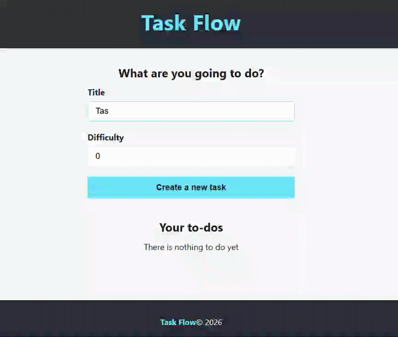

# Task Flow

A simple, responsive to-do list app built with **React + TypeScript**, where users can create, edit, and delete tasks with a difficulty rating.

🔗 **[Live demo](https://rodrigomzanetti.github.io/task-flow/)**

## What it does

- Add a new task with a title and difficulty level
- Edit an existing task through a modal
- Delete tasks from the list
- See an empty-state message when there are no tasks yet

## Tech stack

- [React](https://react.dev/) — UI library
- [TypeScript](https://www.typescriptlang.org/) — static typing on top of JavaScript
- [Vite](https://vite.dev/) — build tool and dev server
- CSS Modules — scoped component styling

## Concepts practiced

- Functional components and hooks (`useState`, `useEffect`)
- Controlled inputs and form handling
- Typed props, including optional props and function props
- Lifting state up between parent and child components
- Conditional rendering and list rendering with `.map()`

## Running locally

\`\`\`bash
git clone https://github.com/RodrigoMZanetti/task-flow.git
cd task-flow
npm install
npm run dev
\`\`\`

The app opens automatically at `http://localhost:3000`
